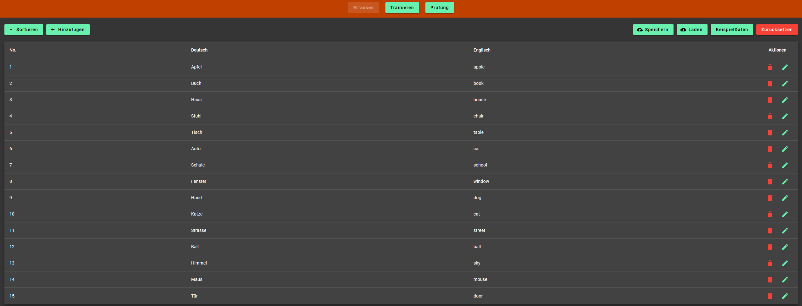
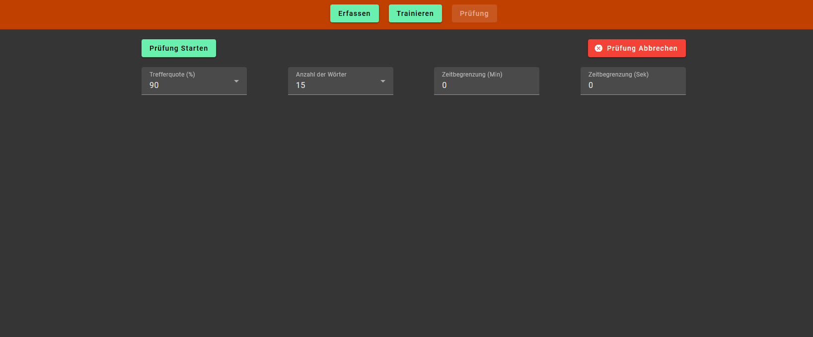
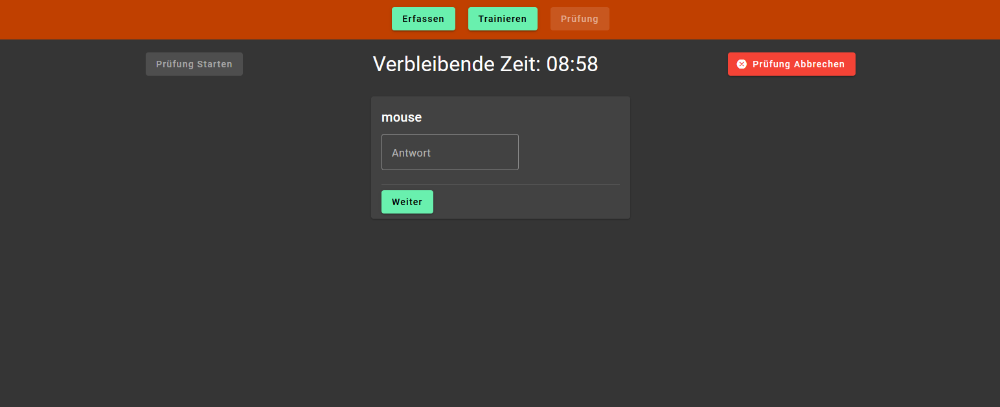
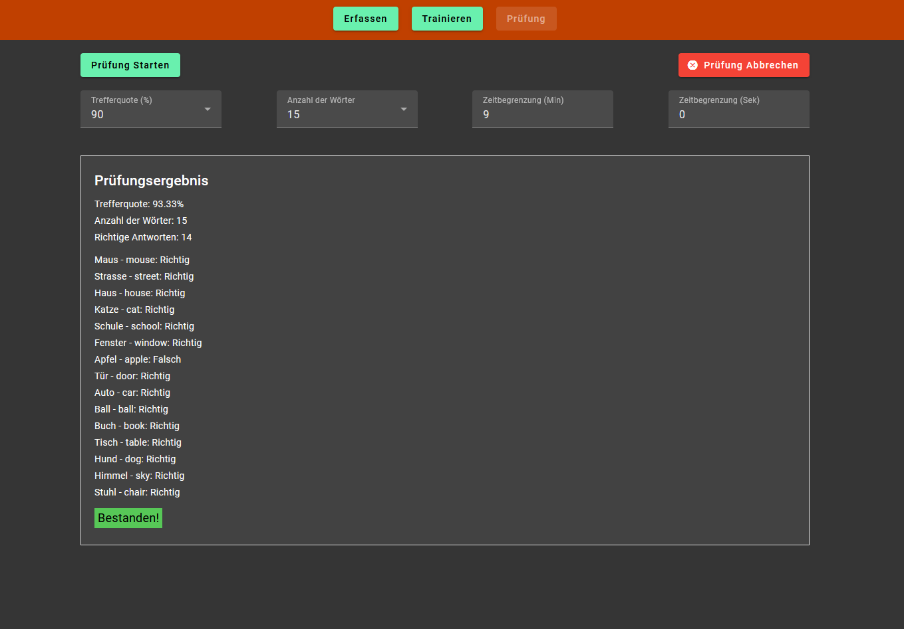

### Wortschatz-Trainer

#### Installationsanleitung:
- Git clone main branch
- `npm install`
- `ng serve --open`

---

#### Aufgabenstellung:
**Erfassen**
- Wortpaare alphabetisch sortiert auflisten
- Wortpaare hinzufügen/bearbeiten/löschen
- Button, um Beispieldaten einzufügen
- Button, um alles zurückzusetzen
- **Bonus:** Die Liste der Wortpaare kann für beide Sprachen sortiert werden
- **Bonus:** Wortliste persistieren (LocalStorage)

**Trainieren**
- Zufällige Abfrage einer Sprache
- Zufällige Auswahl von Wörtern
- Anzeige des korrekten Worts nach falschen Antworten
- **Bonus:** Falsch beantwortete Wörter werden häufiger wieder abgefragt

**Prüfung**
- Tabs Erfassen/Trainieren während der Prüfung gesperrt
- Zufällige Abfrage einer Sprache
- Alle Wörter werden in zufälliger Reihenfolge abgefragt
- Nach der Prüfung wird das Prüfungsresultat und eine Statistik angezeigt
- **Bonus:** Nötige Trefferquote und Anzahl der Wörter können definiert werden
- **Bonus:** Die Prüfungsdauer kann limitiert werden

---

#### Screenshots:

**Erfassen:**

**Trainieren:**

**Prüfung:**

